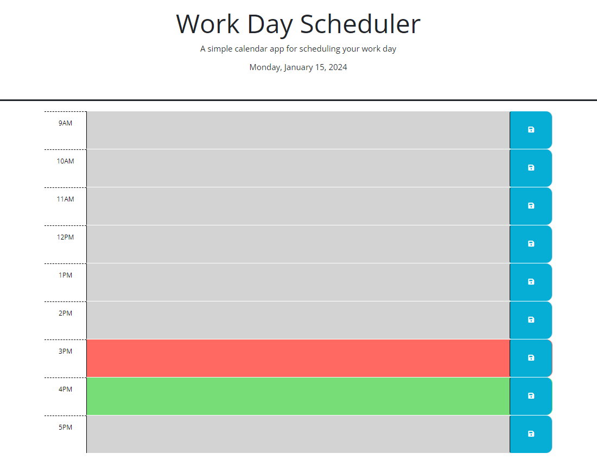

# Work_Day_Scheduler

## Description
A simple calendar application that allows a user to save events for each hour of a typical working day (9am–5pm). This app will run in the browser and feature dynamically updated HTML and CSS powered by jQuery.

## Screenshot

## GitHub Repo
https://github.com/FannyCandy/05_Work_Day_Scheduler

## Deployed App
https://fannycandy.github.io/05_Work_Day_Scheduler/

## Credit / Resources used
NU BootCamp curriculum